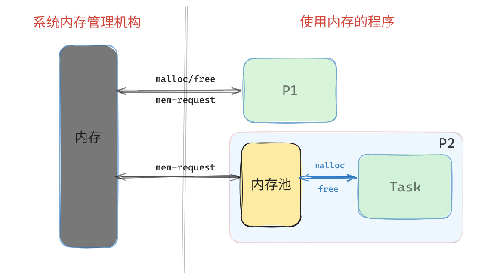
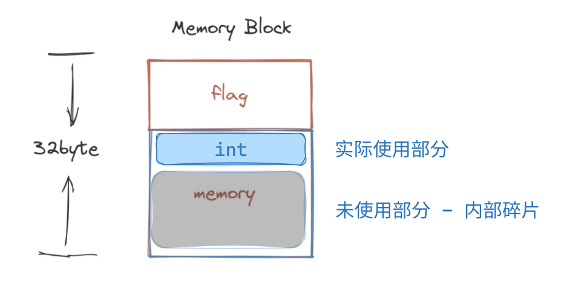
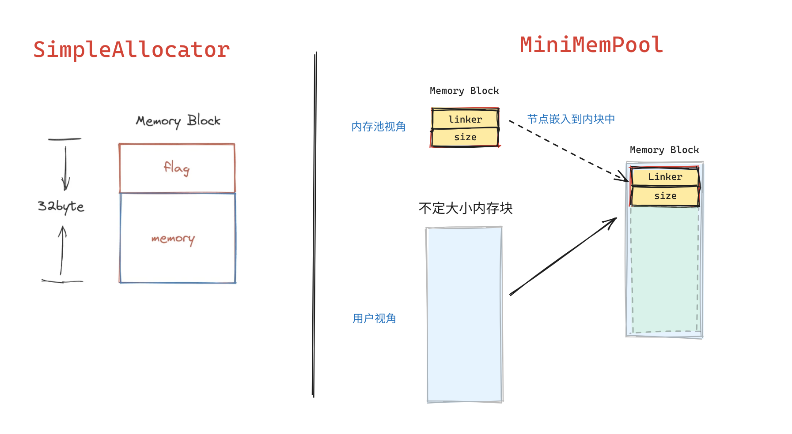
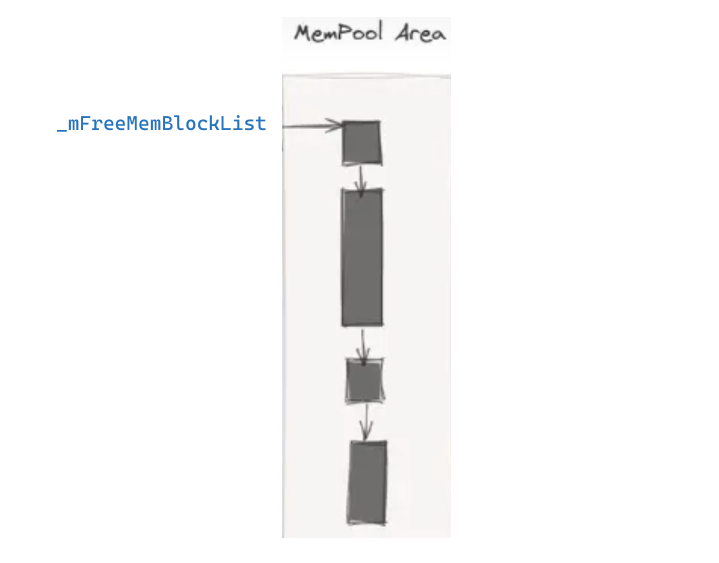

## 静态内存分配器(SMA) 设计与实现 - 迷你内存池篇

### 0. 简介 - 迷你内存池实现

> 部分概念 在[简单分配器篇]()中有介绍, 这里就不过多介绍了

- 基础概念: 内存碎片、内存对齐、内存划分、系统调用
- 数据结构: 嵌入(侵入)式链表、FFMA查找


本文为 **[开源库DStruct库](https://github.com/Sunrisepeak/DStruct)**  **静态内存分配器(SMA) 设计与实现** 系列第二篇 -- **迷你内存池实现篇**(MiniMemPool) 

对一些概念不了解 同学/小伙伴 也可以先看以下第一篇 -- **简单分配器篇** 的内容

感兴趣的也可以直接到Github上阅读`SMA(memory/StaticMemAllocator.hpp)` 的源码, 也欢迎star DStruct 和 相关的反馈


**开源地址:** https://github.com/Sunrisepeak/DStruct


### 1. 背景 - 内存池的自然"诞生"

>  小内存分配/释放触发系统调用对程序的性能影响, 自然而然的就产生了对内存分配/释放进行优化的需求, 因此在用户态引入一个内存池来避免大量小内存分配释放引起的过多的系统调用导致的性能问题就显得很合理了。


#### 1.1 用户态与内核态 & 特权级切换 - 系统调用

特权级一般指的 CPU在运行中的不同的状态, 很多CPU都支持多种特权级别,特权级高的层级可以执行一些低特权级不能执行的CPU指令(例如: 修改页表寄存器, 修改/访问CPU中的特殊寄存器等, 出于安全的考虑, 这些指令和寄存器在用户态时是不能直接访问的。

通常在操作系统的内核设计时, 一般选用最高特权级别用作内核态, 低特权级别用作用户程序态。当用户态的程序要使用内核提供的服务时就需要, 从用户态切换到内核态去执行内核服务程序代码, 而这个过程通常称为 --- **系统调用**

- **X86架构:** 通常分0 ～ 3 4个级别, 数字越低级别越高(0-系统, 1-3 应用)
- **ARM架构:** EL0 ~ EL3 - 应用程序 / 操作系统 / Hypervisor / 安全层
- **RISCV架构:**  U / S / M

**Linux - 系统调用 - Exit **

```c
// x86-32
mov eax, 1       ; 存储系统调用号（例如1表示exit系统调用）
mov ebx, 0       ; 存储系统调用的第一个参数
int 0x80         ; 触发系统调用

// x86-64
mov rax, 60      ; 存储系统调用号（例如60表示exit系统调用）
mov rdi, 0       ; 存储系统调用的第一个参数
syscall          ; 触发系统调用

// ARMv7
mov r7, #1       @ 存储系统调用号（例如1表示exit系统调用）
mov r0, #0       @ 存储系统调用的第一个参数
swi 0            @ 触发系统调用

//riscv
li a7, 93        # 存储系统调用号（例如93表示exit系统调用）
li a0, 0         # 存储系统调用的第一个参数
ecall            # 触发系统调用
```


**系统调用会导致特权级的切换, CPU寄存器的保存与恢复等, 这中服务调用-比用户程序内的函数调用开销大的多**


#### 1.2 小内存分配释放的性能问题

```cpp
#include <iostream>

/*

g++ dstruct/mini_mempool.cpp -I ../DStruct && ./a.out

*/

int main() {

    void* memBlockPtrArr[10] { 0 };
    size_t memBlockSize = 1024 * 10;

    for (int i = 0; i < 10; i++) {
        memBlockPtrArr[i] = static_cast<int *>(malloc(memBlockSize));
        std::cout << "malloc: " << memBlockPtrArr[i] << std::endl;
    }

    for (int i = 0; i < 10; i++) {
        std::cout << "free: " << memBlockPtrArr[i] << std::endl;
        free(memBlockPtrArr[i]);
    }

    return 0;
}
```


**内存分配/释放统计**

> 使用`strace`对系统调用进行追踪&统计
>
> **无内存池支持时, 假设直接调用syscall获取内存**

| 系统调用\内存分配            | 开发者接口请求 | 无内存池支持 | 内存池支持(即于实验环境) |
| ---------------------------- | -------------- | ------------ | ------------------------ |
| 小内存分配100byte - sbrk/brk | 10 + 10        | 10 + 10      | 1 + 1                    |
| 小内存分配100KB - sbrk/brk   | 10 + 10        | 10 + 10      | 1 + 6                    |
| 大内存分配 - mmap/unmmap     | 10 + 10        | 10 + 10      | 10 + 10                  |

> 注: 这里不同环境可能存在差别, 这里仅为讨论内存池在内存分配/释放中降低过多系统调用的引发的性能问题


从上面对于程序的系统调用的粗略统一, 可以清晰的看到如果不在用户态使用内存池, 开发者每一次内存请求都将触发一次**内存相关的系统调用**

而在用户态引入内存池后可以较好的减少触发系统调用的次数, 特别是在大量小内存分配释放的情况, 可以极大减少应系统调用带来的性能开销


既然有了引入内存池的需求, 下面就开始介绍一个极简化版本的内存池`MiniMemPool`的实现及一些相关的基础概念


### 2. 基本概念

#### 2.1 内存池

内存池是一种预先分配和管理的内存区域，**用于提高内存分配和释放的效率**。它通过一次性分配一块连续的内存空间，并自己管理程序释放的内存, 以减少频繁的内存分配和释放操作，提高内存的利用率，并减少动态内存分配的开销。**广泛应用于需要频繁创建和销毁对象的场景(高频小内存分配释放)**，特别是大型且复杂的系统级应用(如网络服务器、数据库系统和游戏引擎等)



#### 2.2 内存管理

通俗理解就是对内存资源的组织、分配、释放的管理。

- 内存的组织管理
- 内存的分配/释放策略

#### 2.3 内存碎片

**内部碎片**

这里用第一篇**SimpleAllocator**分配器中的**固定大小内存块**作为例子, 当开发者使用接口请求一个`sizeof(int)` 大小时, 分配器直接分配了一个32字节大小的内存块, 导致实际仅使用了其中的4字节

而由于该块的所有权已归开发者, 造成了内存块内部的部分内存无法被使用, 而这个 **块内** 未被使用的内存区域就叫做**内部碎片**



**外部碎片**

在多次内存的分配于释放后, 内存区域中变成了大量的小的空闲块

如图 - 内存区域空闲内存有11K, 但是当用户发起一个10K请求时, 在这种情况下系统确只能返回一个内存不足的分配错误

甚至如果没有内存整理机制的情况下, 用户实际可以请求的最大内存大小为2K。而这种在内存区域中分布在不同区域且不连续的内存区域(块)就是内存的**外部碎片**


### 3. MiniMemPool 的设计与实现

#### 3.1 内存块设计

```cpp
// SimpleAllocator
struct MemBlock {
    MemBlockFlag flag; // size_t size;
    char mem[MEM_BLOCK_SIZE - sizeof(MemBlockFlag)]; // useable area
};

// MiniMemPool
struct MemBlock {
    dstruct::_SinglyLink linker;
    size_t size; // 记录内存块大小, 仅在内存池中使用
};
```



**解决不固定内存块问题  -- 嵌入式链表**

由于嵌入式链表对携带数据范型作用, 通过把链表嵌入到不定大小的内存块的头部, 进而管理不同大小的内存块

> 嵌入链表相关概念: https://zhuanlan.zhihu.com/p/675389928




#### 3.2 内存池初始化

```cpp
MiniMemPool() : _mFreeMemSize { 1024 }, _mPoolStartAddr { nullptr }, _mPoolEndAddr { nullptr } {
    MemBlockList::init(&_mFreeMemBlockList);
    (char *)sbrk(0); // init heap
    _mPoolStartAddr = (char *)sbrk(_mFreeMemSize);
    _mPoolEndAddr = _mPoolStartAddr + _mFreeMemSize;
    // init list
    auto *memBlkPtr = reinterpret_cast<MemBlock *>(_mPoolStartAddr);
    memBlkPtr->data = 1024;
    MemBlockList::add(&_mFreeMemBlockList, memBlkPtr);
}
```

使用sbrk/brk系统调用向系统申请1K大小的内存放到内存池的空闲链表中


#### 3.3 内存块查找FFMA实现

```cpp
MemBlock * _memblk_search_ffma(int size) {
    Linker *prevLinkPtr = MemBlockList::to_link(&_mFreeMemBlockList);
    MemBlock *memBlkPtr = nullptr;
    while (prevLinkPtr->next != MemBlockList::to_link(&_mFreeMemBlockList)) {
        auto nodePtr = MemBlockList::to_node(prevLinkPtr->next);
        if (nodePtr->data >= size) {
            Linker::del(prevLinkPtr, prevLinkPtr->next /* nodePtr */);
            memBlkPtr = nodePtr;
            break;
        }
        prevLinkPtr = prevLinkPtr->next;
    }
    return memBlkPtr;
}
```

使用首次适应内存算法(FFMA), 按照链表的默认的排序和请求分配的大小进行搜索匹配

返回第一个匹配的内存块地址, 如果没有找到则返回空


#### 3.4 内存块的插入

```cpp
void _memblk_insert(MemBlock *memBlkPtr) {
    MemBlockList::add(&_mFreeMemBlockList, memBlkPtr);
}
```

这里为了简单, 使用头插法进行实现

也可以使用更加复杂的方法 - 按地址排序 / 按大小排序....


#### 3.5 内存对齐

```cpp
static int _MEM_ALIGN_ROUND_UP(int bytes) {
    return (((bytes) + sizeof(MemBlock) - 1) & ~(sizeof(MemBlock) - 1));
}
```

把`bytes`按照, 链表节点的大小`sizeof(MemBlock)` 为基数向上取整

是为了后面内存分配时, 简化解决过大的**内存-内部碎片**中进行的内存划分过程, 做的一个内存对齐上的预处理操作


#### 3.6 引入allocate/deallocate接口 - 减少内存管理数据结构的空间开销

```cpp
struct Alloc {
    static void * allocate(int bytes);
    static void deallocate(void *addr, int bytes);
};
```

使用allocate/deallocate内存分配/释放代替malloc/free的风格接口。

在结合嵌入式链表的"节点嵌入"的优势, 在把内存块分配用户时 可以**对用于管理内存的数据结构节点的内存进行复用**

实现 内存池和用户 对内存块感知的"双视角"

> 注: malloc/free 和 allocate/deallocate 风格的对比 可见**简单分配器篇**

**allocate实现**

```cpp
static void * allocate(int bytes) {
    void *memPtr = nullptr;
    int alignedSize = _MEM_ALIGN_ROUND_UP(bytes);
    MemBlock *memBlkPtr = _Instance()._memblk_search_ffma(alignedSize);

    if (memBlkPtr == nullptr) {
        memPtr = sbrk(bytes);
        _Instance()._mPoolEndAddr = reinterpret_cast<char *>(memPtr) + bytes;
    } else {
        memPtr = memBlkPtr;
        if (memBlkPtr->data >= alignedSize + sizeof(MemBlock)) {
            auto *memFragmentPtr = reinterpret_cast<char *>(memPtr) + alignedSize;
            MemBlock *memFragmentBlkPtr = reinterpret_cast<MemBlock *>(memFragmentPtr);
            memFragmentBlkPtr->data = memBlkPtr->data - alignedSize;
            _Instance()._memblk_insert(memFragmentBlkPtr);
        }
    }

    return memPtr;
}
```

按照用户的请求大小, 从现有内存池搜索查找匹配的空闲内存块

情况一

> 没有匹配的内存块, 那么就调用sbrk从系统分配返回给用户(注意: 这块内存释放的时候并不会归还给系统, 而是插入到我们维护的内存池中)

情况二

> 在内存池中找到了内存块, 但是当内存块太大时, 直接分配给用户就会造成**内部碎片**的浪费
>
> 所以要对大内存块进行重新划分, 把**内部碎片**重新插入到内存池中

**deallocate实现**

```cpp
static void deallocate(void *addr, int bytes) {
    // mem_valid_check(addr);
    auto memBlkPtr = reinterpret_cast<MemBlock *>(addr);
    memBlkPtr->data = _MEM_ALIGN_ROUND_UP(bytes);
    _Instance()._memblk_insert(memBlkPtr);
}
```

内存的释放就比较简单了, 直接在内存块中嵌入链表结构, 然后再插入到内存池中

> 注: 这里为了简单, 节省了内存合法性/有效性检查


### 4. MiniMemPool 完整代码 & 测试

> 实现了最小内存池的一个骨架, 为了更简单的表述内存池的直观感受
>
> 为了简化`MiniMemPool`并没有处理很多细节

```cpp
// https://github.com/Sunrisepeak/HelloWorld/dstruct/mini_mempool.cpp
// https://github.com/Sunrisepeak/DStruct

#include <unistd.h> // system call
#include <iostream>
#include <dstruct.hpp> // DStruct lib

/*

g++ dstruct/mini_mempool.cpp -I ../DStruct && ./a.out

*/


//#define DEBUG

#define LOGI(...) printf("%s: ", __func__); printf(__VA_ARGS__); printf("\n")

#ifdef DEBUG
#define LOGD(...) LOGI(__VA_ARGS__)
#else
#define LOGD(...)
#endif

class MiniMemPool {
    /*
    struct MemBlock {
        dstruct::_SinglyLink linker;
        int size; // or use size_t
    };
    */
    using Linker = dstruct::_SinglyLink;
    using MemBlock = dstruct::_EmbeddedListNode<int, Linker>;
    using MemBlockList = MemBlock;

public:
    static void * allocate(int bytes) {
        void *memPtr = nullptr;
        int alignedSize = _MEM_ALIGN_ROUND_UP(bytes);
        MemBlock *memBlkPtr = _Instance()._memblk_search_ffma(alignedSize);
        LOGD("request bytes %d, align to %d", bytes, alignedSize);

        if (memBlkPtr == nullptr) {
            LOGD("not found mem-block in mempool, and try to request by sbrk");
            memPtr = sbrk(bytes);
            _Instance()._mPoolEndAddr = reinterpret_cast<char *>(memPtr) + bytes;
            LOGD("sbrk %p, update mem-pool end addr to %p", memPtr, _Instance()._mPoolEndAddr);
        } else {
            memPtr = memBlkPtr;
            if (memBlkPtr->data >= alignedSize + sizeof(MemBlock)) {
                auto *memFragmentPtr = reinterpret_cast<char *>(memPtr) + alignedSize;
                MemBlock *memFragmentBlkPtr = reinterpret_cast<MemBlock *>(memFragmentPtr);
                memFragmentBlkPtr->data = memBlkPtr->data - alignedSize;
                _Instance()._memblk_insert(memFragmentBlkPtr);
                LOGD("split mem-block from [%p, %d] to [[%p, %d], [%p, %d]], and insert to mem-pool",
                    memBlkPtr, memBlkPtr->data,
                    memBlkPtr, alignedSize, memFragmentBlkPtr, memFragmentBlkPtr->data
                );
            }
        }

        LOGD("return memory address %p, real size %d", memPtr, alignedSize);

        return memPtr;
    }

    static void deallocate(void *addr, int bytes) {
        // mem_valid_check(addr);
        auto memBlkPtr = reinterpret_cast<MemBlock *>(addr);
        memBlkPtr->data = _MEM_ALIGN_ROUND_UP(bytes);
        LOGD("release memory to mempool: addr %p, size %d(%d)", addr, bytes, memBlkPtr->data);
        _Instance()._memblk_insert(memBlkPtr);
    }

    static int free_mem_size() {
        return _Instance()._mFreeMemSize;
    }

protected:
    //void *_mPoolStartAddr, *_mPoolEndAddr;
    int _mFreeMemSize;
    char *_mPoolStartAddr, *_mPoolEndAddr;
    MemBlock _mFreeMemBlockList;

    MiniMemPool() : _mFreeMemSize { 1024 }, _mPoolStartAddr { nullptr }, _mPoolEndAddr { nullptr } {
        MemBlockList::init(&_mFreeMemBlockList);
        (char *)sbrk(0); // init heap
        _mPoolStartAddr = (char *)sbrk(_mFreeMemSize);
        _mPoolEndAddr = _mPoolStartAddr + _mFreeMemSize;

        assert(_mPoolStartAddr != (void *)ENOMEM);
        LOGI("init: mem-pool start addr %p, mempool end addr %p, free memory size %d",
            _mPoolStartAddr, _mPoolEndAddr, _mFreeMemSize);

        // init list
        auto *memBlkPtr = reinterpret_cast<MemBlock *>(_mPoolStartAddr);
        memBlkPtr->data = 1024;
        MemBlockList::add(&_mFreeMemBlockList, memBlkPtr);
    }

    MiniMemPool(const MiniMemPool &) = delete;
    MiniMemPool &operator=(const MiniMemPool &) = delete;

    ~MiniMemPool() {
        brk(_mPoolStartAddr);
        _mPoolEndAddr = _mPoolEndAddr = nullptr;
        _mFreeMemSize = 0;
        LOGI("release all memory by brk-syscall");
    }

    static MiniMemPool & _Instance() {
        static MiniMemPool miniMemPool; // create & manage static memory area
        return miniMemPool;
    }

    MemBlock * _memblk_search_ffma(int size) {
        Linker *prevLinkPtr = MemBlockList::to_link(&_mFreeMemBlockList);
        MemBlock *memBlkPtr = nullptr;
        while (prevLinkPtr->next != MemBlockList::to_link(&_mFreeMemBlockList)) {
            auto nodePtr = MemBlockList::to_node(prevLinkPtr->next);
            if (nodePtr->data >= size) {
                Linker::del(prevLinkPtr, prevLinkPtr->next /* nodePtr */);
                memBlkPtr = nodePtr;
                break;
            }
            prevLinkPtr = prevLinkPtr->next;
        }
        return memBlkPtr;
    }

    void _memblk_insert(MemBlock *memBlkPtr) {
        MemBlockList::add(&_mFreeMemBlockList, memBlkPtr);
    }

    static int _MEM_ALIGN_ROUND_UP(int bytes) {
        return (((bytes) + sizeof(MemBlock) - 1) & ~(sizeof(MemBlock) - 1));
    }

};

int main() {

    void* memBlockPtrArr[10] { 0 };
    size_t memBlockSize = 40;

    for (int i = 0; i < 10; i++) {
        memBlockPtrArr[i] = static_cast<int *>(malloc(memBlockSize));
        std::cout << "malloc: " << memBlockPtrArr[i] << std::endl;
    }

    for (int i = 0; i < 10; i++) {
        std::cout << "free: " << memBlockPtrArr[i] << std::endl;
        free(memBlockPtrArr[i]);
    }

    printf("\n---------------------------------------------------------\n\n");

    auto memPtr1 = MiniMemPool::allocate(100);
    LOGD("fmemPtr1 %p", memPtr1);
    MiniMemPool::deallocate(memPtr1, 100);
    auto memPtr2 = MiniMemPool::allocate(100);
    LOGD("memPtr2 %p", memPtr2);
    MiniMemPool::deallocate(memPtr2, 100);

    for (int i = 0; i < 10; i++) {
        memBlockPtrArr[i] = static_cast<int *>(MiniMemPool::allocate(memBlockSize));
        std::cout << "MiniMemPool::allocate: " << memBlockPtrArr[i] << std::endl;
    }

    for (int i = 0; i < 10; i++) {
        std::cout << "MiniMemPool::deallocate: " << memBlockPtrArr[i] << std::endl;
        MiniMemPool::deallocate(memBlockPtrArr[i], memBlockSize);
    }   

    LOGI("MiniMemPool free memory size is %d", MiniMemPool::free_mem_size());

    return 0;
}
```


#### 4.1 MiniMemPool 模拟 libc的 malloc/free - 未开MiniMemPool LOG

> 关闭MiniMemPool的Debug log

```cpp
malloc: 0x55bb42289eb0
malloc: 0x55bb4228a2f0
malloc: 0x55bb4228a320
malloc: 0x55bb4228a350
malloc: 0x55bb4228a380
malloc: 0x55bb4228a3b0
malloc: 0x55bb4228a3e0
malloc: 0x55bb4228a410
malloc: 0x55bb4228a440
malloc: 0x55bb4228a470
free: 0x55bb42289eb0
free: 0x55bb4228a2f0
free: 0x55bb4228a320
free: 0x55bb4228a350
free: 0x55bb4228a380
free: 0x55bb4228a3b0
free: 0x55bb4228a3e0
free: 0x55bb4228a410
free: 0x55bb4228a440
free: 0x55bb4228a470

---------------------------------------------------------

MiniMemPool: init: mem-pool start addr 0x55bb42299000, mempool end addr 0x55bb42299400, free memory size 1024
MiniMemPool::allocate: 0x55bb42299000
MiniMemPool::allocate: 0x55bb42299030
MiniMemPool::allocate: 0x55bb42299070
MiniMemPool::allocate: 0x55bb422990a0
MiniMemPool::allocate: 0x55bb422990d0
MiniMemPool::allocate: 0x55bb42299100
MiniMemPool::allocate: 0x55bb42299130
MiniMemPool::allocate: 0x55bb42299160
MiniMemPool::allocate: 0x55bb42299190
MiniMemPool::allocate: 0x55bb422991c0
MiniMemPool::deallocate: 0x55bb42299000
MiniMemPool::deallocate: 0x55bb42299030
MiniMemPool::deallocate: 0x55bb42299070
MiniMemPool::deallocate: 0x55bb422990a0
MiniMemPool::deallocate: 0x55bb422990d0
MiniMemPool::deallocate: 0x55bb42299100
MiniMemPool::deallocate: 0x55bb42299130
MiniMemPool::deallocate: 0x55bb42299160
MiniMemPool::deallocate: 0x55bb42299190
MiniMemPool::deallocate: 0x55bb422991c0
main: MiniMemPool free memory size is 1024
~MiniMemPool: release all memory by brk-syscall
```


#### 4.2 MiniMemPool 内存分配细节

> 开启MiniMemPool的Debug log

```cpp
malloc: 0x55eb21135eb0
malloc: 0x55eb211362f0
malloc: 0x55eb21136320
malloc: 0x55eb21136350
malloc: 0x55eb21136380
malloc: 0x55eb211363b0
malloc: 0x55eb211363e0
malloc: 0x55eb21136410
malloc: 0x55eb21136440
malloc: 0x55eb21136470
free: 0x55eb21135eb0
free: 0x55eb211362f0
free: 0x55eb21136320
free: 0x55eb21136350
free: 0x55eb21136380
free: 0x55eb211363b0
free: 0x55eb211363e0
free: 0x55eb21136410
free: 0x55eb21136440
free: 0x55eb21136470

---------------------------------------------------------

MiniMemPool: init: mem-pool start addr 0x55eb21145000, mempool end addr 0x55eb21145400, free memory size 1024
allocate: request bytes 100, align to 112
allocate: split mem-block from [0x55eb21145000, 1024] to [[0x55eb21145000, 112], [0x55eb21145070, 912]], and insert to mem-pool
allocate: return memory address 0x55eb21145000, real size 112
main: fmemPtr1 0x55eb21145000
deallocate: release memory to mempool: addr 0x55eb21145000, size 100(112)
allocate: request bytes 100, align to 112
allocate: return memory address 0x55eb21145000, real size 112
main: memPtr2 0x55eb21145000
deallocate: release memory to mempool: addr 0x55eb21145000, size 100(112)
// --------------
allocate: request bytes 40, align to 48
allocate: split mem-block from [0x55eb21145000, 112] to [[0x55eb21145000, 48], [0x55eb21145030, 64]], and insert to mem-pool
allocate: return memory address 0x55eb21145000, real size 48
MiniMemPool::allocate: 0x55eb21145000
allocate: request bytes 40, align to 48
allocate: split mem-block from [0x55eb21145030, 64] to [[0x55eb21145030, 48], [0x55eb21145060, 16]], and insert to mem-pool
allocate: return memory address 0x55eb21145030, real size 48
MiniMemPool::allocate: 0x55eb21145030
allocate: request bytes 40, align to 48
allocate: split mem-block from [0x55eb21145070, 912] to [[0x55eb21145070, 48], [0x55eb211450a0, 864]], and insert to mem-pool
allocate: return memory address 0x55eb21145070, real size 48
MiniMemPool::allocate: 0x55eb21145070
allocate: request bytes 40, align to 48
allocate: split mem-block from [0x55eb211450a0, 864] to [[0x55eb211450a0, 48], [0x55eb211450d0, 816]], and insert to mem-pool
allocate: return memory address 0x55eb211450a0, real size 48
MiniMemPool::allocate: 0x55eb211450a0
allocate: request bytes 40, align to 48
allocate: split mem-block from [0x55eb211450d0, 816] to [[0x55eb211450d0, 48], [0x55eb21145100, 768]], and insert to mem-pool
allocate: return memory address 0x55eb211450d0, real size 48
MiniMemPool::allocate: 0x55eb211450d0
allocate: request bytes 40, align to 48
allocate: split mem-block from [0x55eb21145100, 768] to [[0x55eb21145100, 48], [0x55eb21145130, 720]], and insert to mem-pool
allocate: return memory address 0x55eb21145100, real size 48
MiniMemPool::allocate: 0x55eb21145100
allocate: request bytes 40, align to 48
allocate: split mem-block from [0x55eb21145130, 720] to [[0x55eb21145130, 48], [0x55eb21145160, 672]], and insert to mem-pool
allocate: return memory address 0x55eb21145130, real size 48
MiniMemPool::allocate: 0x55eb21145130
allocate: request bytes 40, align to 48
allocate: split mem-block from [0x55eb21145160, 672] to [[0x55eb21145160, 48], [0x55eb21145190, 624]], and insert to mem-pool
allocate: return memory address 0x55eb21145160, real size 48
MiniMemPool::allocate: 0x55eb21145160
allocate: request bytes 40, align to 48
allocate: split mem-block from [0x55eb21145190, 624] to [[0x55eb21145190, 48], [0x55eb211451c0, 576]], and insert to mem-pool
allocate: return memory address 0x55eb21145190, real size 48
MiniMemPool::allocate: 0x55eb21145190
allocate: request bytes 40, align to 48
allocate: split mem-block from [0x55eb211451c0, 576] to [[0x55eb211451c0, 48], [0x55eb211451f0, 528]], and insert to mem-pool
allocate: return memory address 0x55eb211451c0, real size 48
MiniMemPool::allocate: 0x55eb211451c0
MiniMemPool::deallocate: 0x55eb21145000
deallocate: release memory to mempool: addr 0x55eb21145000, size 40(48)
MiniMemPool::deallocate: 0x55eb21145030
deallocate: release memory to mempool: addr 0x55eb21145030, size 40(48)
MiniMemPool::deallocate: 0x55eb21145070
deallocate: release memory to mempool: addr 0x55eb21145070, size 40(48)
MiniMemPool::deallocate: 0x55eb211450a0
deallocate: release memory to mempool: addr 0x55eb211450a0, size 40(48)
MiniMemPool::deallocate: 0x55eb211450d0
deallocate: release memory to mempool: addr 0x55eb211450d0, size 40(48)
MiniMemPool::deallocate: 0x55eb21145100
deallocate: release memory to mempool: addr 0x55eb21145100, size 40(48)
MiniMemPool::deallocate: 0x55eb21145130
deallocate: release memory to mempool: addr 0x55eb21145130, size 40(48)
MiniMemPool::deallocate: 0x55eb21145160
deallocate: release memory to mempool: addr 0x55eb21145160, size 40(48)
MiniMemPool::deallocate: 0x55eb21145190
deallocate: release memory to mempool: addr 0x55eb21145190, size 40(48)
MiniMemPool::deallocate: 0x55eb211451c0
deallocate: release memory to mempool: addr 0x55eb211451c0, size 40(48)
main: MiniMemPool free memory size is 1024
~MiniMemPool: release all memory by brk-syscall
```


### 5. MiniMemPool的一些问题及思考

#### 5.1 MiniMemPool 解决了 SimpleAllocator的什么问题

- 可以任意请求大小
- 优化内存碎片
- 减少内存块的Head开销
- 优化了小内存分配 - 小内存从内存池中分配, 大内存直接从系统分配

#### 5.2 MiniMemPool的问题

- 为了内存对齐依然存在小于`sizeof(MemBlock)`的**内存-内部碎片**问题
- 在多次分配释放后, 将会存在很多小的**内存-外部碎片**, 程序在长时间运行后 内存分配/释放 效率就会降低
- 每次分配内存使用的算法(FFMA), 时间复杂度是O(n)线性的, 内存块越多, 分配时间约慢 

#### 5.3 相关的思考

- 能否使用平衡树把内存块的搜索效率从`O(n)`降到`O(logN)`? 甚至能不能把小内存块的分配效率降到`O(1)`?
- 当内存-外部碎片多的时候, 怎么进行内存块的合并&内存整理?
- 怎么对内存做安全和有效性校验(内存踩踏 / 多次释放 / ....)?
- 出现问题怎么追踪和调试内存?


**后面的文章将会逐步介绍 或 解决(或找一个权衡的方法来处理)上面的问题， 欢迎感兴趣的同学/伙伴 评论区讨论 和 点赞收藏**


### 6.Other

[测试代码](https://github.com/Sunrisepeak/HelloWorld/blob/main/dstruct/mini_mempool.cpp)

[DStruct: 静态内存分配器(SMA) 设计与实现 - 简单分配器篇](https://github.com/Sunrisepeak/DStruct/blob/main/docs/sma-design/sma-design-part2.md)

[DStruct: 静态内存分配器(SMA) 设计与实现 - 目录](https://github.com/Sunrisepeak/DStruct/tree/main/docs/sma-design)

[SMA静态内存分配器的源码](https://github.com/Sunrisepeak/DStruct/blob/main/memory/StaticMemAllocator.hpp)

**相关开源项目**

DStruct: https://github.com/Sunrisepeak/DStruct

HelloWorld: https://github.com/Sunrisepeak/HelloWorld