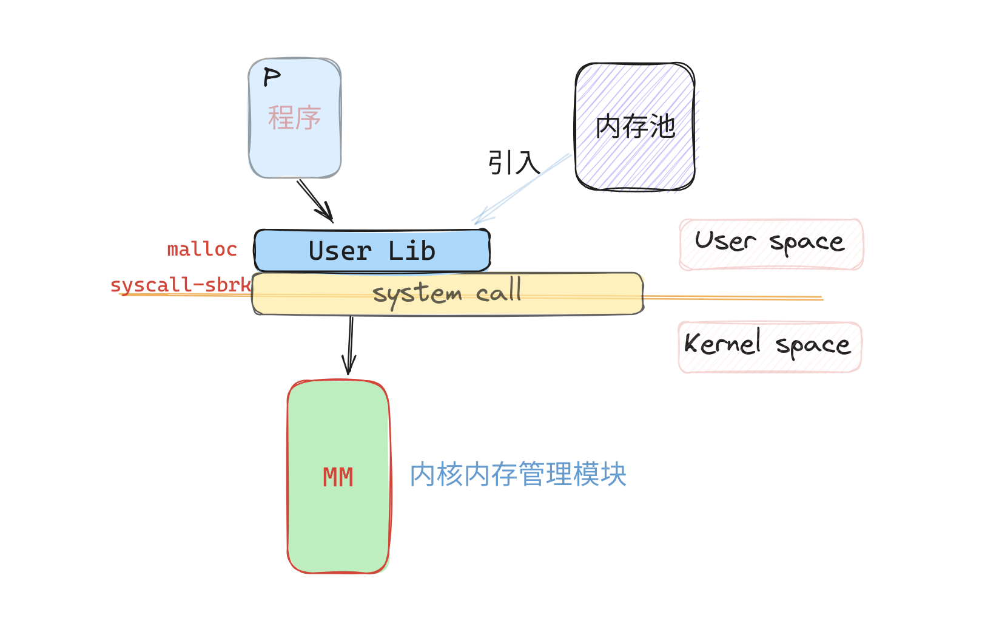
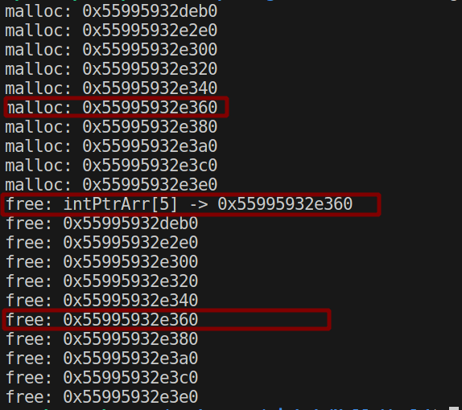

## 静态内存分配器(SMA) 设计与实现 - 迷你内存池实现

### 0. 简介 - 迷你内存池实现

> 部分概念 在[简单分配器篇]()中有介绍, 这里就不过多介绍了

- 基础概念: 内存碎片、内存整理
- 数据结构: 链表、查找


本文为 **[开源库DStruct库](https://github.com/Sunrisepeak/DStruct)**  **静态内存分配器(SMA) 设计与实现** 系列第二篇 -- **迷你内存池实现篇**(MiniMemPool) 

对一些概念不了解 同学/小伙伴 也可以先看以下第一篇 -- **简单分配器篇** 的内容

感兴趣的也可以直接到Github上阅读`SMA(memory/StaticMemAllocator.hpp)` 的源码, 也欢迎star DStruct 和 相关的反馈 [逃] ......


**开源地址:** https://github.com/Sunrisepeak/DStruct


### 1. 背景 - 内存池的自然"诞生"

>  小内存分配/释放触发系统调用对程序的性能影响, 自然而然的就产生了对内存分配/释放进行优化的需求, 因此在用户态引入一个内存池来避免大量小内存分配释放引起的过多的系统调用导致的性能问题就显得很合理了。



#### 1.1 用户态与内核态 & 特权级切换 - 系统调用

特权级一般指的 CPU在运行中的不同的状态, 很多CPU都支持多种特权级别,特权级高的层级可以执行一些低特权级不能执行的CPU指令(例如: 修改页表寄存器, 修改/访问CPU中的特殊寄存器等, 出于安全的考虑, 这些指令和寄存器在用户态时是不能直接访问的。

通常在操作系统的内核设计时, 一般选用最高特权级别用作内核态, 低特权级别用作用户程序态。当用户态的程序要使用内核提供的服务时就需要, 从用户态切换到内核态去执行内核服务程序代码, 而这个过程通常称为 --- **系统调用**

- **X86架构:** 通常分0 ～ 3 4个级别, 数字越低级别越高(0-系统, 1-3 应用)
- **ARM架构:** EL0 ~ EL3 - 应用程序 / 操作系统 / Hypervisor / 安全层
- **RISCV架构:**  U / S / M

**Linux - 系统调用 - Exit **

```c
// x86-32
mov eax, 1       ; 存储系统调用号（例如1表示exit系统调用）
mov ebx, 0       ; 存储系统调用的第一个参数
int 0x80         ; 触发系统调用

// x86-64
mov rax, 60      ; 存储系统调用号（例如60表示exit系统调用）
mov rdi, 0       ; 存储系统调用的第一个参数
syscall          ; 触发系统调用

// ARMv7
mov r7, #1       @ 存储系统调用号（例如1表示exit系统调用）
mov r0, #0       @ 存储系统调用的第一个参数
swi 0            @ 触发系统调用

//riscv
li a7, 93        # 存储系统调用号（例如93表示exit系统调用）
li a0, 0         # 存储系统调用的第一个参数
ecall            # 触发系统调用
```


**系统调用会导致特权级的切换, CPU寄存器的保存与恢复等, 这中服务调用-比用户程序内的函数调用开销大的多**


#### 1.2 小内存分配释放的性能问题

```cpp
#include <iostream>

/*

g++ dstruct/mini_mempool.cpp -I ../DStruct && ./a.out

*/

int main() {

    int* intPtrArr[10] { 0 };

    for (int i = 0; i < 10; i++) {
        intPtrArr[i] = static_cast<int *>(malloc(sizeof(int)));
        std::cout << "malloc: " << intPtrArr[i] << std::endl;
        *(intPtrArr[i]) = i;
    }

    std::cout << "free: intPtrArr[5] -> " << intPtrArr[5] << std::endl;
    free(intPtrArr[5]);
    intPtrArr[5] = static_cast<int *>(malloc(sizeof(int)));

    for (int i = 0; i < 10; i++) {
        std::cout << "free: " << intPtrArr[i] << std::endl;
        free(intPtrArr[i]);
    }

    return 0;
}
```




假设上述程序每次都是通过系统调用(**例如sbrk**)获取内存或释放内存, 那么我们可以得到如下数据

- **分配内存11次**
- **释放内存11次**
- **总系统调用22次**


### 2. 基本概念

#### 2.1 内存池

#### 2.2 内存管理

#### 2.3 内存碎片


### 3. 管理内存 - 解决任意分配大小问题

#### 3.1 "任意"分配大小

#### 3.2 内存块设计

#### 3.3 最先适应算法 - FFMA


### 4. MiniMemPool 代码实现

#### 4.1 内存块设计

#### 4.2 链表管理 - 内存块查找FFMA实现

#### 4.3 测试分配与释放


### 5. 外部内存碎片 与 内存整理/合并


### 6. MiniMemPool的一些问题及思考

#### 6.1 MiniMemPool 解决了 SimpleAllocator的什么问题

#### 6.2 MiniMemPool的问题

#### 6.3 相关的思考


### 7.Other

[DStruct: 静态内存分配器(SMA) 设计与实现 - 目录](https://github.com/Sunrisepeak/DStruct/tree/main/docs/sma-design)

[DStruct项目地址](https://github.com/Sunrisepeak/DStruct)

[SMA静态内存分配器的源码](https://github.com/Sunrisepeak/DStruct/blob/main/memory/StaticMemAllocator.hpp)

[测试代码](https://github.com/Sunrisepeak/HelloWorld/blob/main/dstruct/simple_allocator.cpp)

